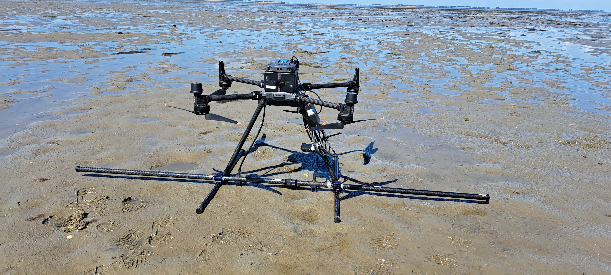

The Drowned Villages of the Scheldt project explores a remarkable yet vulnerable landscape in the Eastern Scheldt estuary. Hidden beneath the tidal flats lie the remains of late medieval villages that once thrived on reclaimed land. These villages, now submerged, offer unique time capsules that provide insight into how people lived with and shaped a dynamic coastal environment. The projects tests and develops tools for documenting and preserving drowned landscapes in tidal and underwater zones. This includes a UAV-based approach, in which we equip our drones with magnetometer sensors, flying at very low heights above the surface.