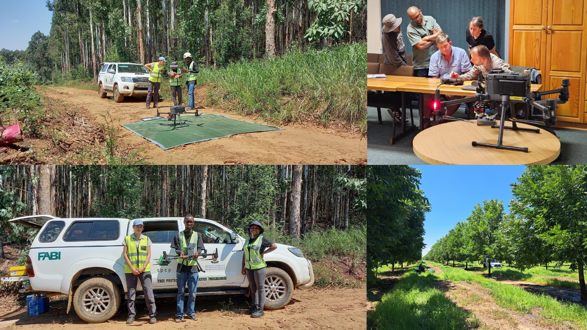

The VLIR-UOS Short Initiatives project “Establishing hyperspectral sensing and processing skills for research on climate- and diseaseresistant crops and trees in South Africa” focuses on transferring essential skills on hyperspectral laboratory and UAV-based imaging. he project's central goal is to develop local skills and capacity through partnerships with Ghent University to establish hyperspectral sensing technologies for deployment in plant breeding and remote sensing. Transferable skills are not limited to hyperspectral sensing, but include training in big data management and processing.